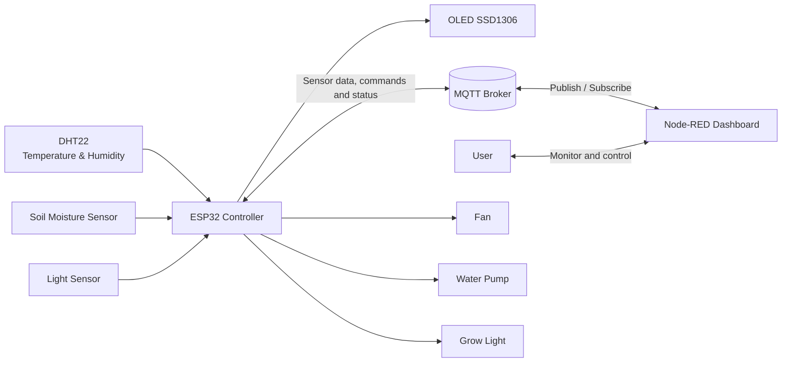

# Smart Greenhouse

Hệ thống giám sát và điều khiển nhà kính thông minh sử dụng **ESP32**, **MQTT**, **Wokwi** và **Node-RED Dashboard**.

Dự án mô phỏng một hệ thống IoT có khả năng theo dõi nhiệt độ, độ ẩm không khí, độ ẩm đất và cường độ ánh sáng. ESP32 có thể tự động điều khiển quạt, máy bơm và đèn trồng cây theo các ngưỡng thiết lập, đồng thời cho phép người dùng điều khiển thủ công từ giao diện Node-RED.


## 📖 Giới thiệu

Smart Greenhouse là mô hình nhà kính thông minh được xây dựng nhằm:

- Giám sát các thông số môi trường theo thời gian thực.
- Tự động điều khiển thiết bị dựa trên dữ liệu cảm biến.
- Cho phép chuyển đổi giữa chế độ **Automatic** và **Manual**.
- Truyền dữ liệu hai chiều giữa ESP32 và Node-RED bằng MQTT.
- Mô phỏng toàn bộ phần cứng trước khi triển khai thiết bị thực tế.

Dự án sử dụng Wokwi để mô phỏng mạch ESP32 và Node-RED Dashboard để hiển thị dữ liệu cũng như điều khiển thiết bị.

---

## Chức năng chính

### Giám sát cảm biến

- Nhiệt độ môi trường.
- Độ ẩm không khí.
- Độ ẩm đất.
- Cường độ ánh sáng.
- Hiển thị dữ liệu cục bộ trên màn hình OLED.

### Điều khiển thiết bị

- Quạt thông gió.
- Máy bơm tưới nước.
- Đèn trồng cây.
- Chế độ điều khiển tự động.

### Chế độ hoạt động

#### Automatic Mode

ESP32 tự động bật hoặc tắt các thiết bị theo giá trị cảm biến và các ngưỡng được khai báo trong `config.h`.

#### Manual Mode

Người dùng điều khiển trực tiếp quạt, máy bơm và đèn trồng cây từ Node-RED Dashboard. Sau khi thực hiện lệnh, ESP32 gửi trạng thái thực tế trở lại Dashboard để đồng bộ giao diện.

---

## 🏗 Kiến trúc hệ thống



Luồng hoạt động chính:

1. ESP32 đọc dữ liệu từ các cảm biến.
2. Dữ liệu được gửi đến MQTT Broker.
3. Node-RED nhận dữ liệu và cập nhật Dashboard.
4. Người dùng gửi lệnh điều khiển từ Dashboard.
5. ESP32 nhận lệnh, cập nhật GPIO và gửi lại trạng thái thiết bị.

---

## Linh kiện và công nghệ

### Phần cứng mô phỏng

| Thành phần | Chức năng |
|---|---|
| ESP32 DevKit V1 | Bộ điều khiển trung tâm |
| DHT22 | Đo nhiệt độ và độ ẩm không khí |
| Soil Moisture Sensor | Đo độ ẩm đất |
| LDR/Light Sensor | Đo cường độ ánh sáng |
| OLED SSD1306 128×64 | Hiển thị dữ liệu cục bộ |
| LED/Output mô phỏng | Đại diện cho quạt, bơm và đèn |

### Phần mềm và nền tảng

| Công nghệ | Mục đích |
|---|---|
| Wokwi | Mô phỏng ESP32 và mạch điện |
| Arduino Framework | Lập trình ESP32 |
| MQTT | Giao tiếp thời gian thực |
| HiveMQ Public Broker | MQTT Broker |
| Node-RED | Xử lý luồng dữ liệu |
| FlowFuse Dashboard 2 | Giao diện giám sát và điều khiển |

### Thư viện Arduino

Các thư viện được khai báo trong `libraries.txt`:

```text
DHT sensor library
Adafruit GFX Library
Adafruit SSD1306
PubSubClient
ArduinoJson
```

---

## 🔌 Sơ đồ chân ESP32

| Thiết bị | Chân ESP32 |
|---|---:|
| DHT22 | GPIO 4 |
| Soil Moisture Sensor | GPIO 34 |
| Light Sensor | GPIO 35 |
| Fan | GPIO 26 |
| Water Pump | GPIO 27 |
| Grow Light | GPIO 2 |
| OLED SDA | GPIO 21 mặc định |
| OLED SCL | GPIO 22 mặc định |

> Các chân kết nối phải khớp giữa `config.h` và `diagram.json`.

---

## Nguyên tắc điều khiển tự động

| Thiết bị | Điều kiện bật | Điều kiện tắt |
|---|---|---|
| Quạt | Nhiệt độ ≥ 30°C hoặc độ ẩm ≥ 80% | Nhiệt độ ≤ 27°C và độ ẩm ≤ 70% |
| Máy bơm | Độ ẩm đất ≤ 35% | Độ ẩm đất ≥ 55% |
| Đèn trồng cây | Ánh sáng < 30% | Ánh sáng > 50% |

Hệ thống sử dụng ngưỡng bật và ngưỡng tắt khác nhau để tạo vùng trễ **hysteresis**, giúp hạn chế việc thiết bị bật/tắt liên tục khi giá trị cảm biến dao động gần ngưỡng.

---

## MQTT Topics

### Sensor Topics

| Topic | Nội dung |
|---|---|
| `greenhouse/temp` | Nhiệt độ |
| `greenhouse/humidity` | Độ ẩm không khí |
| `greenhouse/soil` | Độ ẩm đất |
| `greenhouse/light` | Cường độ ánh sáng |

### Control Topics

| Topic | Nội dung |
|---|---|
| `greenhouse/control/fan` | Điều khiển quạt |
| `greenhouse/control/pump` | Điều khiển máy bơm |
| `greenhouse/control/light` | Điều khiển đèn |
| `greenhouse/control/auto` | Bật/tắt Automatic Mode |

### Status Topics

| Topic | Nội dung |
|---|---|
| `greenhouse/status/fan` | Trạng thái thực tế của quạt |
| `greenhouse/status/pump` | Trạng thái thực tế của bơm |
| `greenhouse/status/light` | Trạng thái thực tế của đèn |
| `greenhouse/status/auto` | Trạng thái Automatic Mode |

Payload điều khiển:

```text
1 = ON
0 = OFF
```

Các status topic được publish với chế độ retained để Dashboard nhận được trạng thái gần nhất khi kết nối lại.

---

## Cấu trúc dự án

```text
SmartGreenhouse/
├── SmartGreenhouse.ino   # Chương trình chính
├── config.h              # GPIO, Wi-Fi, MQTT và ngưỡng điều khiển
├── globals.h             # Khai báo dữ liệu dùng chung
├── globals.cpp           # Khởi tạo dữ liệu dùng chung
├── sensor.h              # Khai báo hàm cảm biến
├── sensor.cpp            # Đọc và xử lý cảm biến
├── control.h             # Khai báo hàm điều khiển
├── control.cpp           # Điều khiển Auto/Manual và GPIO
├── wifi.h                # Khai báo kết nối Wi-Fi
├── wifi.cpp              # Xử lý kết nối Wi-Fi
├── mqtt.h                # Khai báo hàm MQTT
├── mqtt.cpp              # Publish, subscribe và callback MQTT
├── display.h             # Khai báo hiển thị OLED
├── display.cpp           # Cập nhật màn hình OLED
├── diagram.json          # Sơ đồ mạch Wokwi
├── libraries.txt         # Danh sách thư viện Wokwi
└── flows.json            # Node-RED flow
```

---

## Hướng dẫn chạy dự án

### 1. Clone repository

```bash
git clone https://github.com/PhaNguyxn/SmartGreenhouse.git
cd SmartGreenhouse
```

### 2. Chạy mô phỏng trên Wokwi

1. Tạo một dự án ESP32 mới trên Wokwi.
2. Thêm toàn bộ file mã nguồn trong repository.
3. Thêm `diagram.json`.
4. Thêm `libraries.txt`.
5. Nhấn **Start Simulation**.
6. Kiểm tra Serial Monitor để xác nhận ESP32 kết nối Wi-Fi và MQTT.

Cấu hình mặc định:

```cpp
#define WIFI_SSID "Wokwi-GUEST"
#define WIFI_PASSWORD ""

#define MQTT_SERVER "broker.hivemq.com"
#define MQTT_PORT 1883
```

### 3. Cài đặt Node-RED

Yêu cầu cài Node.js trước, sau đó chạy:

```bash
npm install -g node-red
node-red
```

Mở Node-RED Editor:

```text
http://localhost:1880
```

### 4. Cài FlowFuse Dashboard 2

Trong Node-RED:

```text
Menu → Manage Palette → Install
```

Tìm và cài:

```text
@flowfuse/node-red-dashboard
```

### 5. Import Node-RED Flow

1. Mở **Menu → Import**.
2. Chọn file `flows.json`.
3. Kiểm tra MQTT Broker là `broker.hivemq.com:1883`.
4. Nhấn **Deploy**.
5. Mở đường dẫn Dashboard đã được cấu hình trong flow.

### 6. Chạy hệ thống

Thứ tự đề xuất:

1. Khởi động Node-RED.
2. Mở Dashboard.
3. Chạy mô phỏng Wokwi.
4. Chờ ESP32 kết nối MQTT.
5. Kiểm tra dữ liệu cảm biến trên các gauge.
6. Thử Automatic Mode và Manual Mode.
